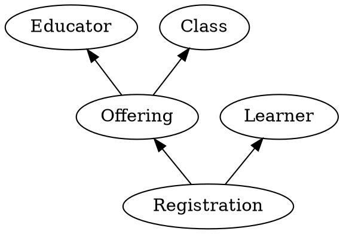

# Learning Objectives

- Recognize a historical model
- Identify historical facts within a domain
- Relate successors to their predecessors
- Compare to Event Sourcing
- Understand that a model constrains a solution
- Understand that those constraints enable certain capabilities

## Example: A Learning Platform

Let's make these ideas concrete.
Consider a learning platform.
This might be used for corporate training or for formal education.
Through this platform, educators offer classes, and learners register to take them.
Let's represent these concepts as historical facts.

# CRDTs

I would start with analyzing the domain in terms of events.
That will help with whatever path you end up taking.
One thing I would add is to explicitly document where one event depends upon another.
Draw an arrow from the subsequent event to its predecessor.
This gives you a directed acyclic graph of history (what I call a historical model).
 
From there you have options.
For one, you could implement your application directly in terms of those events (what I call facts, because they are partially ordered unlike traditional events).
For another, you could go with the RabbitMQ solution and use a topological order (one of the possible orderings through the DAG).
 
I wish I could give you a turnkey solution for CRDTs.
I’m working on one right now (Jinaga.NET), but it is not ready for prime time.
I’ve explored a couple of the general-purpose CRDT implementations (mostly for other platforms), and found them lacking.
They basically give you lists and property bags, not rich application behavior.
 
I would love to spend some time with you exploring the domain and identifying the historical model.
This is an exercise I do on most of my projects, and it unlocks a great deal of value.
From there, the next step should become clearer.
 