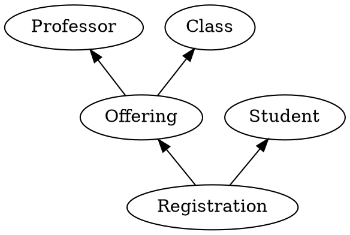
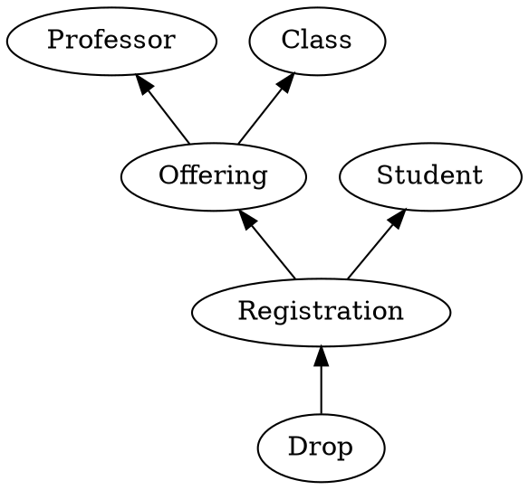

# Learning Objectives

- Recognize a historical model
- Identify historical facts within a domain
- Relate successors to their predecessors
- Compare to Event Sourcing
- Understand that a model constrains a solution
- Understand that those constraints enable certain capabilities

## Example: A Learning Platform

Let's make these ideas concrete.
Consider a learning platform.
Through this platform, professors offer classes, and students register to take them.
Let's represent these concepts as historical facts.

The actors "Professor" and "Student" are facts.
There will, of course, be multiple instances of these actors, but this particular diagram is all about the types.
We'll see other diagrams that are about instances later.

An "Offering" is the fact that a professor has offered a class.
The idea here is that there will be a class -- for example MATH 1710: Calculus I.
A professor might offer that class several times, over several semesters.
In fact, different professors may offer that same class.
Each offering is a specific instance of a professor teaching a class.

When a student registers for a class, they are actually registering for a specific offering.
That's why the "Registration" fact points to the "Offering", not the "Class".
Through that registration, the student can see which class they've signed up for.
And they can also see which instructor will be teaching the class.
All of that information is captured indirectly as predecessors of the registration.

## Tombstones

A historical fact is something that has happened.
No matter what happens next, that fact happened.
You cannot take it back.
So does that mean that a student can't change their mind?
Can they not drop a class?

Of course they can.
It just needs to be represented in the model.
Dropping a class is itself a historical fact.

Notice how the "Drop" fact points to the "Registration".
Even though we say a student "dropped a class", it's really a specific registration for a specific offering that the student dropped.
They can always register for a different offering of that class later.
In fact, they could even re-register for the same offering if they change their mind again.

We can't delete facts.
But we can create new facts that tell us that they should be deleted.
These new facts are called "tombstones".
They mark the end of life of a fact.
But that fact did live.

# CRDTs

I would start with analyzing the domain in terms of events.
That will help with whatever path you end up taking.
One thing I would add is to explicitly document where one event depends upon another.
Draw an arrow from the subsequent event to its predecessor.
This gives you a directed acyclic graph of history (what I call a historical model).
 
From there you have options.
For one, you could implement your application directly in terms of those events (what I call facts, because they are partially ordered unlike traditional events).
For another, you could go with the RabbitMQ solution and use a topological order (one of the possible orderings through the DAG).
 
I wish I could give you a turnkey solution for CRDTs.
I’m working on one right now (Jinaga.NET), but it is not ready for prime time.
I’ve explored a couple of the general-purpose CRDT implementations (mostly for other platforms), and found them lacking.
They basically give you lists and property bags, not rich application behavior.
 
I would love to spend some time with you exploring the domain and identifying the historical model.
This is an exercise I do on most of my projects, and it unlocks a great deal of value.
From there, the next step should become clearer.
 