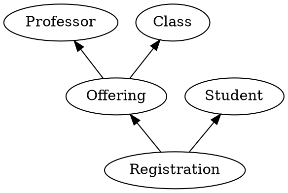
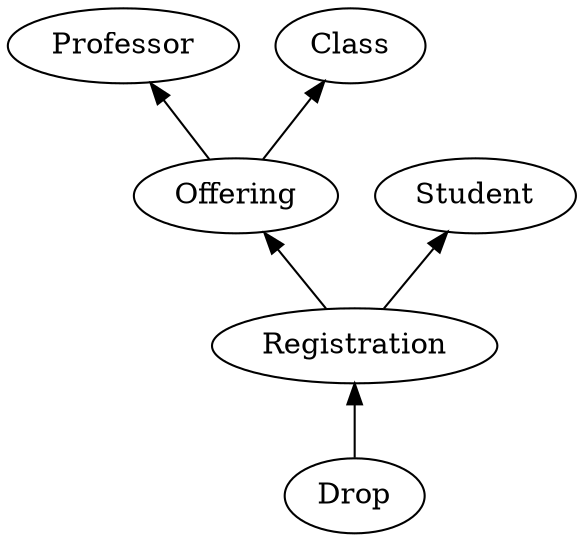

Historical Modeling is an analytical practice.
It's all about defining the historical facts that make up a domain.
When you hear *facts*, you could think *events* -- things that have happened in the past.
But facts can also represent entities, actors, relationships, modifications, even destruction.
It's all in how the facts are related.

Fortunately, there is only one relationship between facts: the predecessor/successor relationship.
The *predecessor* is the fact that was earlier.
The *successor* was later.
We can build a causal graph of facts using only this relationship.

## Example: A Learning Platform

Let's make these ideas concrete.
Consider a learning platform.
Through this platform, professors offer classes, and students register to take them.
Let's represent these concepts as historical facts.

The actors "Professor" and "Student" are facts.
If you want to think of these as events, the are the hiring of a professor and the enrollment of a student.
In other kinds of models, you might be encouraged to use a past-tense verb phrase, such as "StudentEnrolled".
But in this system, we recognize that the enrollment creates -- indeed *defines* -- the student.
And so the fact of enrollment is the same as the fact of the student.

An "Offering" is the fact that a professor has offered a class.
The idea here is that there will be a class -- for example "MATH 1710: Calculus I".
A professor might offer that class several times, over several semesters.
In fact, different professors may offer that same class.
Each offering is a specific instance of a professor teaching a class.

When a student registers for a class, they are actually registering for a specific offering.
That's why the "Registration" fact points to the "Offering", not the "Class".
Through that registration, the student can see which class they've signed up for.
And they can also see which instructor will be teaching the class.
All of that information is captured indirectly as predecessors of the registration.

## Tombstones

A historical fact is something that has happened.
No matter what happens next, that fact happened.
You cannot take it back.
So does that mean that a student can't change their mind?
Can they not drop a class?

Of course they can.
It just needs to be represented in the model.
Dropping a class is itself a historical fact.

Notice how the "Drop" fact points to the "Registration".
Even though we say a student "dropped a class", it's really a specific registration for a specific offering that the student dropped.
They can always register for a different offering of that class later.
In fact, they could even re-register for the same offering if they change their mind again.

We can't delete facts.
But we can create new facts that tell us that they should be deleted.
These new facts are called "tombstones".
They mark the end of life of a fact.
But that fact did live.

## Putting Facts In Order

In this model, it makes sense that a student must have registered for a class offering before dropping the class.
Doing things in the opposite order wouldn't make any sense.
The "Registration" preceeds the "Drop".
You can call "Registration" the *predecessor*, and "Drop" the *successor*.

The model indicates this order with an arrow.
The head of the arrow points to the predecessor, while the tail is on the successor.
Sure, the arrow helps us answer a question: *which* registration was dropped.
But just as importantly, it defines an order between those two facts.

So what about the order between two other facts, say the "Student" and the "Class".
Did the student enroll in this school before MATH 1710 was offered?
Or did they know about that class ahead of time?
The model doesn't say.
It could have happened in either order.
And the result would have been the same.

Other systems of modeling would put these two events in order.
A temporal model, for example, puts a time stamp on every event.
An event-sourced system would put them into a sequential store.
In either case, you could tell which one came first.

But a historical model lets order be ambiguous if there is no arrow (or path of arrows) joining two facts.
Temporal models and event sourcing put events into a *total order*.
Historical models put facts into a *partial order*.
This distinction is the defining characteristic of a historical model, and gives rise to its advantages.

## What To Expect

A historical model will reveal a great deal about a problem domain.
Once you document the obvious orderings like "Registration" before "Drop", you will start to discover less obvious constraints.
You might even start to question some of those choices.
Do I really need to identify a "Professor" before "Registration"?
Or can I find the professor later?
Could I perhaps hire an instructor the week before class starts?

A historical model will show you where you have made assumptions.
Maybe something you believed to be true wouldn't actually work in practice.
The model will reveal that.
And it will give you options for rewriting these assumptions to turn them into something practical.

But don't expect historical modeling to be easy.
Coming up with a good model for a domain takes practice.
Knowing that it's "the right" model may be impossible.
There are always trade-offs.
A historical model makes those trade-offs visible.

Most importantly, expect your model to challenge you.
It will show you all of the flaws in your reasoning.
It will not allow you to quietly gloss over a mistake and pretend that it won't have consequences.
It will put those mistakes in a spotlight for anyone who cares to look.

And seeing your mistakes, you will be able to correct them before they turn into problems.
